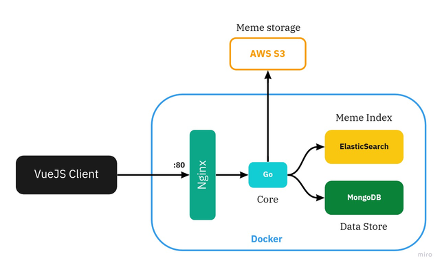

# That Meme
A meme finding utility built using Go, AWS S3, ElasticSearch, MongoDB

### Production Layout

### Local Dev Environment Layout

### Software Prerequisites

1. Go
2. Elasticsearch
3. MongoDB

### Library Dependencies

#### Go
1. Mux

